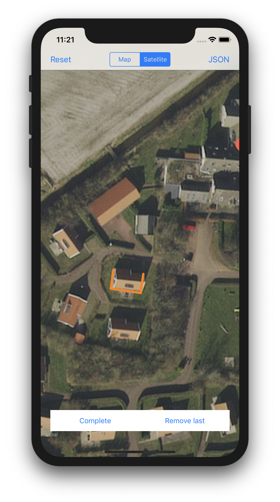
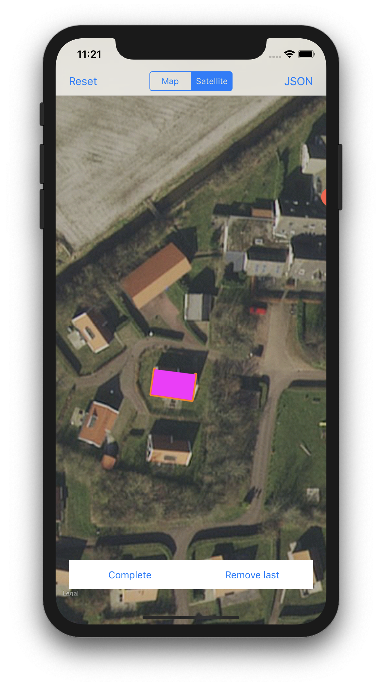
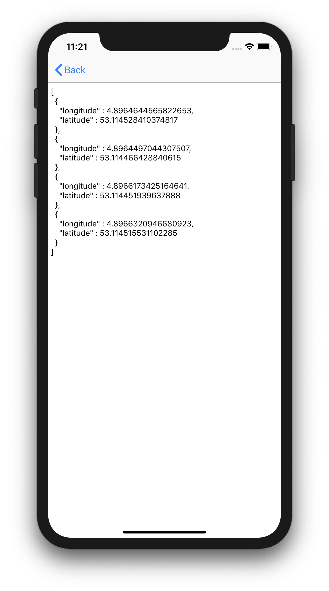

# Polygon to JSON
This is a simple app that lets you draw 1 polygon and then convert it to JSON. The JSON is presented pretty and in a TextView, which you can copy from.

This is made for the [SwiftIsland](https://swiftisland.nl) event in the Netherlands, to make it easier to draw all the bungalows on a map.

## Examples:
Draw | Complete | Generate
:-------------------------:|:-------------------------:|:-------------------------:
 |  | 
